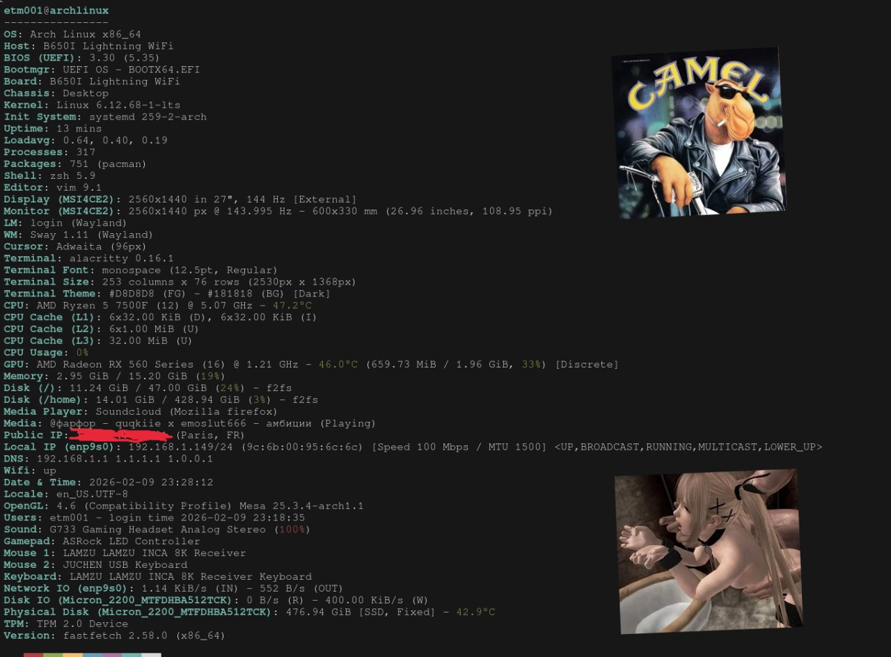
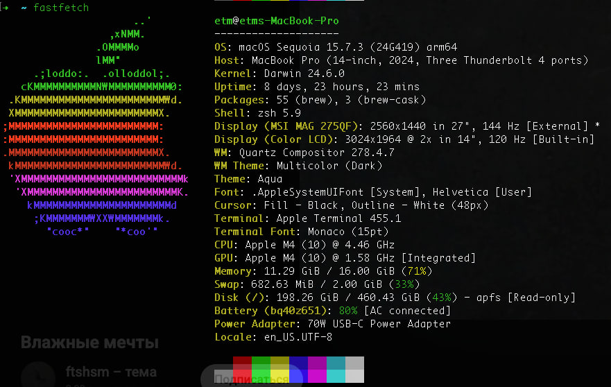

# Dotfiles





## INSTALLLLLLLLL SWAAAAAAAAAAAYYYWLL

```bash
chmod +x sway && ./sway.sh
```

### VSCODE SETTINGS

```json
{
  "editor.minimap.enabled": false,
  "editor.quickSuggestionsDelay": 0,
  "editor.formatOnSave": true,
  "editor.guides.bracketPairs": "active",
  "explorer.confirmPasteNative": false,
  "editor.fontLigatures": true,
  "explorer.confirmDelete": false,
  "explorer.confirmDragAndDrop": false,
  "explorer.compactFolders": false,
  "editor.defaultFormatter": "hashicorp.terraform",
  "git.ignoreMissingGitWarning": true,
  "git.openRepositoryInParentFolders": "always",
  "redhat.telemetry.enabled": false,
  "[yaml]": {
    "editor.tabSize": 2,
    "editor.insertSpaces": true,
    "editor.detectIndentation": false,
    "editor.codeLens": true,
    "editor.autoIndent": "advanced",
    "editor.defaultFormatter": "kennylong.kubernetes-yaml-formatter",
    "diffEditor.ignoreTrimWhitespace": false,
    "editor.formatOnSave": true,
    "editor.quickSuggestions": {
      "other": true,
      "comments": true,
      "strings": true
    }
  },
  "[go]": {
    "editor.tabSize": 4,
    "editor.insertSpaces": false,
    "editor.defaultFormatter": "golang.go",
    "editor.formatOnSave": true,
    "editor.codeActionsOnSave": {
      "source.organizeImports": "explicit"
    }
  },
  "[python]": {
    "editor.formatOnSave": true,
    "editor.defaultFormatter": "ms-python.autopep8"
  },
  "[json]": {
    "editor.quickSuggestions": {
      "strings": true
    },
    "editor.defaultFormatter": "vscode.json-language-features",
    "editor.formatOnSave": true
  },
  "[nix]": {
    "editor.tabSize": 2,
    "editor.codeLens": true,
    "editor.formatOnSave": true
  },
  "security.workspace.trust.untrustedFiles": "open",
  "terminal.integrated.cursorStyle": "line",
  "terminal.integrated.fontSize": 14,
  "telemetry.enableCrashReporter": false,
  "telemetry.enableTelemetry": false,
  "update.mode": "none",
  "extensions.autoUpdate": false,
  "extensions.ignoreRecommendations": true,
  "yaml-with-script.enabled": true,
  "editor.fontSize": 11.5,
  "window.zoomLevel": 1
}
```

### firefox settings

```json
user_pref("browser.contentblocking.category", "custom");
user_pref("privacy.fingerprintingProtection", true);
user_pref("privacy.trackingprotection.emailtracking.enabled", true);
user_pref("privacy.trackingprotection.enabled", true);
user_pref("privacy.trackingprotection.socialtracking.enabled", true);

user_pref("privacy.donottrackheader.enabled", true);
user_pref("privacy.globalprivacycontrol.enabled", true);
user_pref("privacy.globalprivacycontrol.was_ever_enabled", true);

user_pref("browser.safebrowsing.malware.enabled", false);
user_pref("browser.safebrowsing.phishing.enabled", false);

user_pref("privacy.firstparty.isolate", true);
user_pref("privacy.firstparty.isolate.restrict_opener_access", false);

user_pref("security.webauth.u2f", true);
user_pref("security.webauth.webauthn", true);
user_pref("security.webauth.webauthn_enable_softtoken", true);
user_pref("security.webauth.webauthn_enable_usbtoken", true);

user_pref("privacy.clearOnShutdown_v2.browsingHistoryAndDownloads", true);
user_pref("privacy.clearOnShutdown_v2.cache", true);
user_pref("privacy.clearOnShutdown_v2.formdata", true);
user_pref("privacy.sanitize.clearOnShutdown.hasMigratedToNewPrefs3", true);

user_pref("app.normandy.first_run", false);
user_pref("app.shield.optoutstudies.enabled", false);
user_pref("datareporting.healthreport.uploadEnabled", false);
user_pref("datareporting.usage.uploadEnabled", false);
user_pref("toolkit.telemetry.reportingpolicy.firstRun", false);
user_pref("browser.search.serpEventTelemetryCategorization.regionEnabled", false);

user_pref("network.cookie.cookieBehavior", 0);
user_pref("extensions.formautofill.creditCards.enabled", false);
user_pref("dom.forms.autocomplete.formautofill", false);
user_pref("signon.rememberSignons", false);
user_pref("browser.urlbar.placeholderName", "DuckDuckGo");
user_pref("browser.urlbar.placeholderName.private", "DuckDuckGo");
user_pref("browser.urlbar.shortcuts.actions", false);
user_pref("browser.urlbar.shortcuts.bookmarks", false);
user_pref("browser.urlbar.showSearchSuggestionsFirst", false);

user_pref("browser.urlbar.quickactions.enabled", false);
user_pref("browser.urlbar.quickactions.showPrefs", false);
user_pref("browser.urlbar.shortcuts.quickactions", false);
user_pref("browser.urlbar.suggest.quickactions", false);

user_pref("browser.search.region", "US");
user_pref("browser.search.widget.inNavBar", true);
user_pref("general.useragent.locale", "en-US");
user_pref("distribution.searchplugins.defaultLocale", "en-US");


user_pref("app.update.channel", "default");
user_pref("extensions.update.enabled", false);

user_pref("browser.toolbars.bookmarks.visibility", "always");
user_pref("browser.startup.homepage", "https://app.todoist.com/app/inbox");
user_pref("browser.tabs.loadInBackground", true);
user_pref("browser.link.open_newwindow", true);
user_pref("general.autoScroll", true);

user_pref("browser.shell.checkDefaultBrowser", false);
user_pref("browser.shell.didSkipDefaultBrowserCheckOnFirstRun", true);

user_pref("sidebar.notification.badge.aichat", false);
user_pref("font.size.variable.x-western", 18);
user_pref("layout.css.prefers-color-scheme.content-override", 0);
user_pref("media.webspeech.synth.dont_notify_on_error", true);

```
