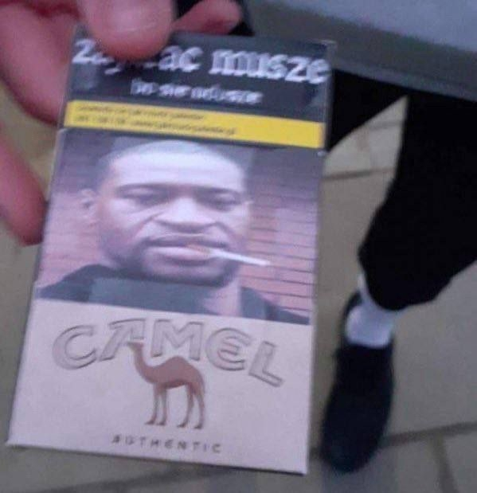
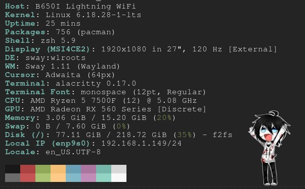

# Dotfiles





[neovim confs](https://github.com/eatmore01/nvim)


```bash
chmod +x sway && ./sway.sh
```


```bash
hidutil property --set '{"UserKeyMapping":[
  {"HIDKeyboardModifierMappingSrc":0x7000000E3,"HIDKeyboardModifierMappingDst":0x7000000E2},
  {"HIDKeyboardModifierMappingSrc":0x7000000E2,"HIDKeyboardModifierMappingDst":0x7000000E3}
]}'
```
